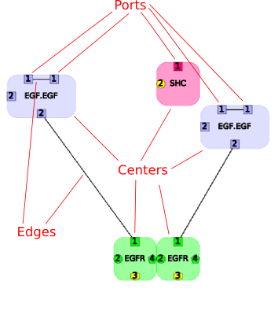
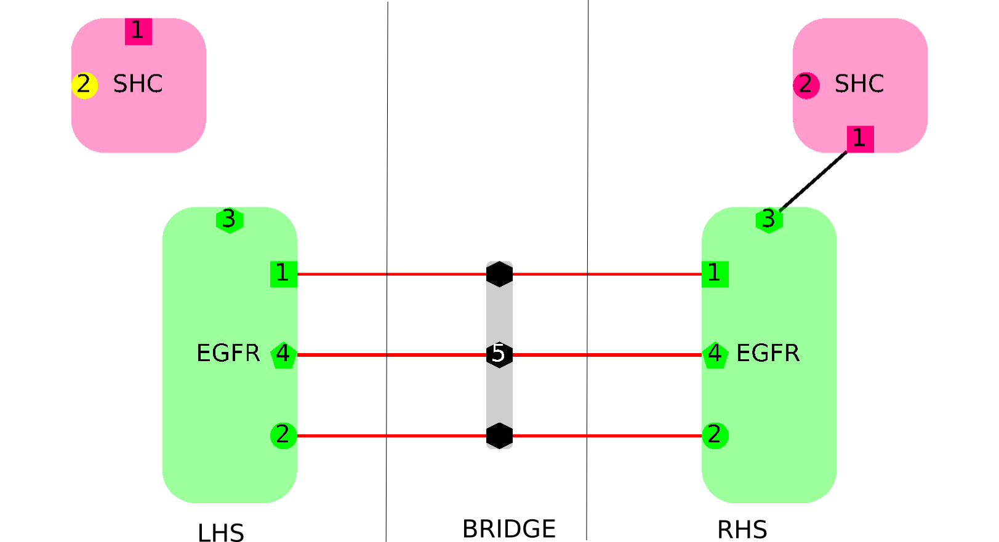
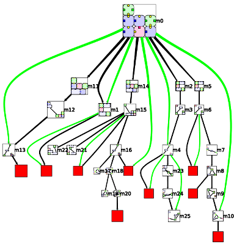

********************
Porgy data structure
********************

A graph rewriting system is made of these elements :

* **Graph**: the graph being rewritten.
* **Rule**: a transformation rule.
* **Derivation tree**: keeps a trace of each rewrite operation.

Graph and rules are made with a specific graph structure called a **Portgraph**. To be fully understandable, this part of the documentation requires a good knowledge
of the Tulip data structure and the latest publication about Porgy (see the `Porgy web site`_ and the publication at the GRAPHITE 2014 workshop).

.. _Porgy web site: http://tulip.labri.fr/TulipDrupal/?q=porgy

Portgraphs
==========

    A portgraph with 5 nodes.

Nodes of a portgraph have ports and two nodes can be connected by an edge only via ports. Internally, a portgraph node with 4 ports is made with 5 Tulip nodes and 4 edges connected
with a star structure. The central node is called ''center''.

 .. figure:: _images/portnode2.png
    :width: 30%
    :align: center

    Internal structure of a portgraph node

The following Tulip property is used in order to identify correctly each part of a portnode:

* **NodeType**: Integer Property which handle node types. Two possible values: 1 for center and 2 for ports.

Rules
=====

    Rewriting rule example

A rule is composed of a left-hand side (LHS), a right hand-side (RHS) and a bridge which connects both sides.
The red edges represent connections of equivalent ports between LHS and RHS. For instance, the two ports labeled **1** in the LHS EGFR portnode is connected to
the RHS EGFR port also labeled **1**. These specific edges allow to restore node properties and their connections to the rest of the graph after rewriting.
All connections between the left-hand side and the right-hand side must go through a port of the bridge.

Some additional properties are required to define a rule:

* **Arity**: Arity of a LHS port.
    Sometimes a port needs to be connected to some other ports in the graph which are not part of LHS. This property is used to indicate the minimum required degree of a port.
* **RuleSide**: for nodes and edges indicates in which part of the rule the element is (Integer property).
    There are four possible values: **1** for *LHS*, **2** for *RHS*, **3** for the *bridge* (red edges for instance), **4** to identify *a port of the bridge* and **5** to identify **specific edges** which connect two LHS ports via the bridge.
    The value **4** is used to indicate which node is the center of the bridge. It is also used for the edges on either side of the bridge.
    The value **5** is used for edges only when a subgraph of LHS have to be replaced by a single edge. The edge is going from a port *a* of LHS to a port of the bridge,
    then from this latter to another LHS port called *b*. Then, the rewriting will consist in removing LHS
* **M**: RHS only. When sets to true, the element is added to the current position set after rewriting.
* **N**: RHS only. When sets to true, the element is added to the current ban set after rewriting.

Graphs
======

Graphs have some additional properties to keep a trace of each transformation:
* **new**: Boolean property set to true if the edge or the portnode is new, i.e. it has been created or modified by the last transformation.

The morphisms between a rule LHS and a graph *G* are saved as subgraphs of *G*. Each subgraph is the instantiation of a rule LHS and uses some specific properties and graph attributes:

* **tag**: Integer property filled with the Tulip id of the corresponding node or edge in the rule LHS.
* **P Property**: graph attribute which handles the property name used as the position set or *NoPosition* if positions were not used.
* **Ban Property**: graph attribute which handles the property name used as the ban set or *NoBan* if ban was not used.
* **rulename**: graph attribute which handles the name of the rule used.

Derivation trees
================

The nodes of the derivation tree are Tulip metanodes associated to each generated graphs.
There is a black or purple edge between two metanodes *a* and *b* if the application of a rule transforms a source graph *a* into a destination graph *b*.
The label of the metanodes (on the left side of each node) is the name of the graph.
The result of a strategy is represented by a green edge between the source graph and the result of the strategy.
A red node indicates a failure, i.e. a rewriting operation was not possible.

    Example of a derivation tree.

The edges of the derivation tree has many properties which handles all parameters of the rewriting operations:

* **Type**: Integer property which can be *0* to indicate a standard metanode of *1* to indicate that the node is a failure node.
* **Transformation_Ban_PropertyName**:
* **Transformation_Instance**:
* **Transformation_PPropertyName**:
* **Transformation_Parallel_Information**:
* **Transformation_Rule**:

