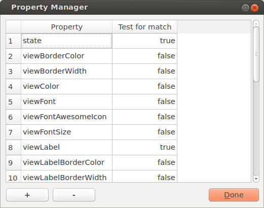
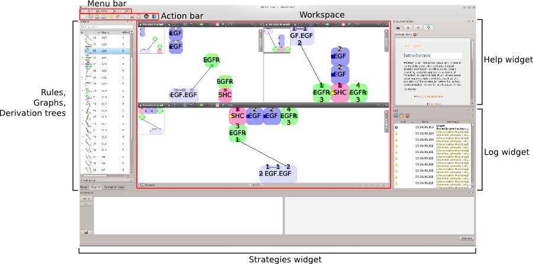
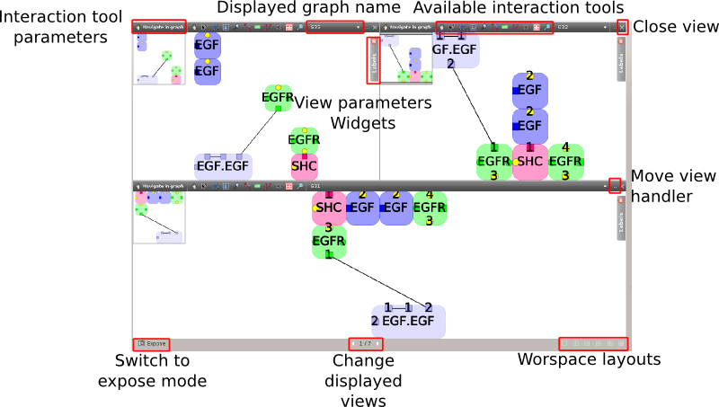
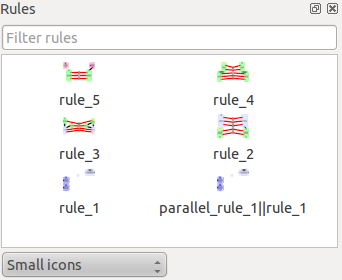
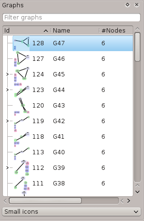
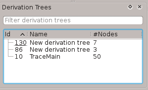
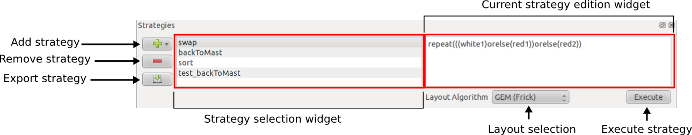

********************
Porgy User Interface
********************

.. |new| raw:: html

    <i class="fa fa-file" aria-hidden="true"></i>

.. |open| raw:: html

    <i class="fa fa-folder-open" aria-hidden="true"></i>

.. |save| raw:: html

    <i class="fa fa-save" aria-hidden="true"></i>

.. |undo| raw:: html

    <i class="fa fa-undo" aria-hidden="true"></i>

.. |redo| raw:: html

    <i class="fa fa-repeat" aria-hidden="true"></i>

.. |copy| raw:: html

    <i class="fa fa-copy" aria-hidden="true"></i>

.. |cut| raw:: html

    <i class="fa fa-cut" aria-hidden="true"></i>

.. |paste| raw:: html

    <i class="fa fa-paste" aria-hidden="true"></i>

.. |help| raw:: html

    <i class="fa fa-question-circle" aria-hidden="true"></i>

This section describes the **Porgy** user interface.
If you need some additional information on an element move the cursor on it and press **F1** on Windows or Linux and the help key on Mac to gain access to the help page.

    Overview of the *Porgy* interface

Menu
====

* **File**: Contains the usual file operations, see the Tulip user manual for additional information about this menu.
    * **New**: Clear the current session and create a new empty one.
    * **Open**: Open a saved session.
    * **Save**: Save the current session.
    * **Save As**: Save the current session in a new file.
    * **Exit**: Quit the software.
* **Edit**:
    * **Undo**: Undo the last operation.
    * **Redo**: Redo the last undo operation.
    * **Copy**: Copy the selected portnodes and edges from the active view to the clipboard. *This option is only available if the active view is a Rule view or a graph view.*
    * **Cut**: Cut the selected  portnodes and edges from the active view. *This option is only available if the active view is a Rule view or a graph view.*
    * **Paste**: Paste the portnodes and the edges from the clipboard to the active rule view. *This option is only available if the active view is a Rule view or a graph view.*
    * **Select all**: Clear the selection then add the portnodes and the edges present in the active view.
    * **Deselect all**: Clear the selection.
    * **Invert selection**: Invert the selection. Selected elements become unselected and unselected become selected.
    * **Delete selection**: Delete portnodes and edges selected in the active view. *This option is only available if the active view is a Rule view or a graph view.*
    * **Property manager**: Allows users to select the properties to use during rewriting operations as matching parameters (for more information, consult :ref:`property_manager`).
* **Algorithm**: Allows the user to compute and apply algorithm.
    * **Measure**: Compute and assign a value to the 'viewMetric' property of graph elements. For example, when running the 'Portnode's degree' algorithm, the degree (the number of neighbors) is computed and stored, for each portnode, into its 'viewMetric' property.
    * **Selection**: Selects nodes and/or edges based on advanced criteria. (Selecting means assigning the 'viewSelection' property).
    * **General**: Contains all the base porgy algorithms. This menu is made for an advance use of Porgy.
* **Docks**: Allows to show and hide dock widgets in the Porgy user interface.
* **Windows**: Manages the sub-windows of the view window.
* **Help**: Gives access to this documentation.

-------
Toolbar
-------

    * |new| **New**: Clear the current session and create a new empty one.
    * |open| **Open**: Open a saved session.
    * |save| **Save**: Save the current session.
    * |undo| **Undo**: Undo the last operation.
    * |redo| **Redo**: Redo the last undo operation.
    * |copy| **Copy**: Copy the selected portnodes and edges from the active view to the clipboard. *This option is only available if the active view is a Rule view or a graph view.*
    * |cut| **Cut**: Cut the selected  portnodes and edges from the active view. *This option is only available if the active view is a Rule view or a graph view.*
    * |paste| **Paste**: Paste the portnodes and the edges from the clipboard to the active rule view. *This option is only available if the active view is a Rule view or a Graph view.*
    * |help| **Help**: Show the help widget.

Workspace/Views
===============

The workspace is the central place where the visualizations are displayed. Every time a graph, a rule or a derivation tree is opened, its corresponding view will be displayed in this space. If one or more views are already present in the workspace, the new one will be set in the last position. More information concerning the specific views can be found in :ref:`views`.

-------------------------
Navigating into the views
-------------------------

There is different ways to switch the views displayed in the workspace:

* **Change the workspace layout:** using the control buttons located at the bottom-right of the workspace, you can change the number of views displayed at a same time. Some layouts are only available when enough views are opened simultaneously and the required number of views is reach. By default only one view is displayed at once.
* **Switch displayed views:** the current view can be changed by clicking on the left or right arrow buttons located at the bottom of the workspace.
* **Use the Expose mode:** click on the expose button at the bottom left of the workspace to switch to the *Expose mode*. In this mode, each view is represented by a preview and can reordered by drag and dropping.
* **Reorder the views in the workspace:** drag and drop the view using the move view handler located in the top-right corner of each view.

------------------
Configuring a view
------------------

The list of the configuration widgets for each view appear in as tabs at the top-right corner of each view. To edit those parameters, just click on a tab to expand the configuration widget. Click on the small cross in the tab to close the opened widget.

-------------------------------------
Changing the current interaction tool
-------------------------------------

To select an interaction tool just click on the icon of the interaction tool you want in the list. The current interaction tool button will be updated with the tool name and icon.

Some interaction tools can be configured by clicking on the interaction tool button at the top left side of the view toolbar. The configuration widget will pop up. If the interaction tool cannot be configured a short description of the tool will appear. To close the configuration widget click again on the current interaction tool button.

.. _rule_widget:

Rule widget
=============

Click on **Rules** tab to access to the Rules management widget. Here one can create, visualize and destruct rules.
Use the text line at the top of the widget to filter rules using rule names.

There is four preview mode :

* **List**: Display the rules in a list without any preview
* **Small icons**: Rules are shown using a small preview icon.
* **Medium icons**: Intermediate sized icons.
* **Large icons**: Enlarged rule previews.

To display an even bigger preview of a rule, hover it with your mouse cursor and wait a second.

---------------
Contextual menu
---------------

By right-clicking in the rule widget, a menu appear offering the following options:

* **Show** : A rule must be selected to enable this action. Displays a visualization/edition view for the selected rule. One can also double click on the rule or drag and drop the view on the workspace to display it.
* **Create new** : Create a new empty rule.
* **Rename** : Rename the hovered rule.
* **Clone** : A rule must be selected to enable this action. Clone the selected rule, i.e create a copy of the rule with the same port nodes and the same values.
* **Delete** : A rule must be selected to enable this action. Delete the rule. If the rule is used in an existing graph it cannot be deleted.

* **Import** : Open a file browser window allowing to import one or several rules previously exported (files must have the appropriate extension: *x.porgy.rule*).
* **Export** : Independently save the currently hovered rule for later import.

More information concerning the Rule view is available in the :ref:`rule_view` section.

.. _model_widget:

Graph widget
==============

Click on **Graphs** tab to access to the graphs management widget.
Use the text line at the top of the widget to filter them using names.

There is four preview modes:

* **No icons**: Do not display previews.
* **Small icons**
* **Medium icons**
* **Large icons**

To display a larger preview, hover one of the graphs in the list. After a moment, a tool-tip with a larger preview will appear.
You can display a visualization/edition view for a graph by double clicking on it or by dragging it and dropping it on the workspace.

More information concerning the Graph view is available in the :ref:`model_view` section.

.. _trace_widget:

Derivation tree widget
========================

Click on **Derivation Trees** tab to access to the Derivation Trees management widget.
Use the text line at the top of the widget to filter derivation trees using names.
You can display a visualization/edition view by double clicking on it or by dragging it and dropping it on the workspace.
There is several kinds of visualizations (see the views section for more information on Porgy views).

* **Derivation Tree view**: This is the general visualization for derivation trees.
* **Scatter plot 2D view**
* **Histogram view**
* **Small multiple view**

To rename a derivation tree select it and click with the left button on the it's name. Input the new name then press return to validate the new name. If you press the escape button the edition will be canceled.

---------------
Contextual menu
---------------

A right-click on the existing derivations will propose the following options:

* **Show** : Create a visualization/edition view on the workspace. One can also double click on the rule or drag and drop a list element on the workspace to display it.
* **Create new** : Create a new derivation tree based on the graphs selected in the main derivation tree.
* **Delete** :Destruct the selected element. One cannot delete the main derivation tree.

More information concerning the derivation tree view is available in the :ref:`trace_view` section.

.. _strategy_widget:

Strategy widget
==================

This widget handle all the strategies' management actions.

* **Add strategy** :
    * **Create an empty strategy**
    * **Strategy from derivation tree** : try to compute the strategy from the selected graph elements in the main derivation tree.
    * **Import from a file** : load a strategy from a file. The new strategy will have the name of the file loaded without the file extension.
* **Remove strategy**: remove the selected strategy
* **Export strategy** : save the selected property on the disk.

------------------
Edition
------------------

When selecting a strategy by clicking on its name in the widget, its code appear in the editor on the right. From here, instructions can be typed to specify in details how the rules can be applied. A complete syntax and set of instruction exist and the entire grammar can be consulted in details in the following section.

Log widget
==========

This widget will display the information, warning and error messages send by porgy.

.. todo:: ajouter une figure

