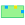

.. _rewriting_example:

********************************
Rewriting in action - A tutorial
********************************

In the following sections, we will explain the guidelines to start working using **Porgy**. We will:

* start using a random graph, 
* create a few different rules using specific properties for the pattern matching, 
* apply the rules a few times separately,
* create a strategy for applying the rules in a specific order and, finally,
* execute the strategy some times to obtain a few branches on the derivation tree.

.. screen capture in 900x1000 px

Import new graph
================

As a starting point, we generate a random simple graph using the appropriate plugin embedded within the platform. After having launched **Porgy**, choose the item *Random Simple PortGraph* in the *File > Import* menu.

A new window will open allowing you specify the generation options. We use the following settings:

The options **nodes**, **edges** and **Connected** are specific to the generator and allow to indicate respectively how many nodes and edges the graph will contain and whether or not the graph have to be connected.

The two remaining options are specific to **Porgy**:

* **Additional ports**: By default, each connection to a portnode is achieved using a different port (*i.e.*, if a node is of degree *X* then, it will have *X* ports, one for each in- or out-coming edge). Enabling the **Additional ports** option will give the exact same number of ports to every portnode while disabling it will reduce the number of ports to one.

* **Same In/Out ports**: By default, edge orientation is not considered in **Porgy**, setting this option to false differentiate the existing ports in two distinctive ones labelled *In* and *Out*. Edges will leave a portnode through an *Out* port and arrive using an *In* port.

Those options are also available when importing a *tlp* graph. A new option is then accessible, proposing to keep the previously used layout or recompute a new one. 

The graph is generated and imported in the list of graphs as *G0* (see :ref:`model_widget`). You can see that creating this first graph also create *TraceMain*, the main derivation tree. The list of available traces is available in the :ref:`trace_widget`.

If generated using the same parameters, your G0 should be similar to this one:

The visual properties of the nodes' and ports' shapes, sizes and colours are using default values. We keep them as such for now.

Rule creation
=============

With the initial graph imported, we can start the rule creation. For this tutorial, we will create three different rules achieving the following goals:

* change the color of a node from *red* to *blue*,
* divide an existing *blue* node in two *yellow* nodes and
* merge three *yellow* nodes in a single *red* node.

The colour will consequently be an important information for our rules and will need to be used as a matching property. To enable this, we must activate the *viewColor* property in the :ref:`property_manager` (accessible in the menu *Edit > Property Manager*).

-------------------
Rule 1: red to blue
-------------------

One can create a new rule by performing a right click in the :ref:`rule_widget` and selecting *Create a new rule* in the contextual menu:

After having specified the name of the newly created rule (we choose to call it **red-blue**), a double click on the rule icon in the :ref:`rule_widget` (or using a right click and selecting *Show*) will create a new :ref:`rule_view`.

The view only contains a bridge node for now. This element is used to mark the transition between the left-hand side and the right-hand side. We consequently use it as a visual cue indicating the limit between the LHS and the RHS.

Our rule is supposed to change the color of a node from *red* to *blue*, we thus have to create a *red* node on the left, a blue node on the right and link the two elements appropriately.

Red portnode
""""""""""""

* First, we must select the interactor allowing to create portnodes |addPortNode|.
* Clicking on the name of the interactor display its parameters

* The interactor lists all the different types of existing portnodes. For now, the only one available corresponds to the red portnode similar to those existing in *G0*.

* We will use a slightly modified version of this portnode, double-click on the red element to open the customization widget in which we will change the field *Name* to *1*

* The new variation of the *red* portnode found in *G0* is now available and is marked as *1* with a red background.

* Click on it in the list to highlight it and click on the *left* of the bridge to create a new portnode in the left-hand side of the rule.

Blue portnode
"""""""""""""

To add the blue variation of the portnode, we have to create a new portnode.

* In the *Add a portnode* interactor parameters, click on the button *Create a new portnode* to display the portnode creator assistant.

* Here we can customized the new portnode by changing its name, colour and number of ports. We set the name to *2* and change the default colour to a light blue (RGB=0,85,255). Each port can also be personalized by adapting their name, shape and colour. We add two ports to our portnode and set their shape to be a *Rounded Box* with a pure blue colour (RGB=0,0,255).

* Once validated, the new type of portnode will appear in the list as a *2* with a blue background. It can then be selected and added to the right of the bridge in the rule.

Linking the portnodes
"""""""""""""""""""""

In portgraphs, ports are used as means to connect the portnodes together. In the rules, ports use is twofold:

* they can be used in the left-hand or the right-hand side indifferently to connect portnodes
* they can be used to connect elements from the LHS to the RHS to indicate specific ways to reconnect the transformed elements.

In our example case, the two ports are similar so the fashion followed to reconnect the transformed element is quite simple. We set each distinct port from the LHS to be corresponding to a unique and distinct port in the RHS. To indicate this in the :ref:`rule_view`, we will use the same interactor used to add portnodes.

* Click on a port of the *red* portnode then click on a port of the *blue* portnode.
* Repeat the process with the two other ports.

Red edges connecting the LHS to the RHS are created with these operations. In our case, they will be used to reconnect the edges attached to the *red* portnode. 

The **red-blue** rule is now finished and can be directly applied to the graph to start rewriting operations. If your are impatient to proceed, consult the :ref:`next section <apply_rule>` to find out how to apply a rule otherwise, there is still two rules to create.

----------------------
Rule 2: blue to yellow
----------------------

Now that the bases have been set, we are able to move a bit quicker. This second rule have to divide an existing *blue* node in two *yellow* nodes. 

* As previously seen, we start by creating a new rule (in the :ref:`rule_widget`, right-click then *Create new*) called **blue-2yellow**.

* We add a *blue* portnode on the left of the bridge.

* We create a new portnode variation with two ports following the steps previously shown for the *blue* portnode creation. The portnode name is set to *3* and its colour is changed to a light yellow (RGB=255,255,127) while its ports receive a primary yellow (RGB=255,255,0).

* We then add two *yellow* portnodes on the right of the bridge.

* Deciding how to connect the transformed elements is a bit more specific this time as we divide the *blue* portnode in two different portnodes. We choose to reroute the edges connected to a *blue* port toward only one *yellow* port. The two *yellow* portnodes, result of the transformation, are connected through their unused ports. The edge is created by clicking on each port successively when using the interactor |addPortNode|.

This achieve the rule **blue-2yellow** which is now ready to be used in a rewriting operation.

---------------------
Rule 3: yellow to red
---------------------

With the two previous rules achieved, this last one will be set in no time. We simply want to merge three *yellow* nodes in a single *red* one. 

* We create a new rule which we call **3yellow-red**.

* All the type of nodes have been created before so we only have to place and connect three yellow nodes on the left of the bridge and a single red one on the right.

* We then connect the *yellow* portnodes to the two remaining ports to the *red* portnode.

With the three rules **red-blue**, **blue-2yellow** and **3yellow-red** now ready, we can focus on their application to the graph *G0*. Let us see how we can use each of these rules to transform our initial graph.

---------------------
Layout algorithm
---------------------

Upon rule application, and particularly when the number of elements appearing is greater than the number of elements being replaced, the layout can become unclear. In those case, it is advisable to redraw the graph altogether. This can be done by selecting a layout in the :ref:`rule_view` under the tab *Rule Attribute*:

Be aware that, when visualizing large number of elements, redrawing the graph can disturb the mental map of the user because of the possible change of each node position. 

In our case, we choose the *FM^3* layout, a force directed layout quick to compute and which gives generally good results. We apply this modification to all the rules previously created, however, the rule **blue-2yellow** is the one to which it will profit the most.

.. _apply_rule:

Applying a rule
===============

In **Porgy** there is two way to apply a rule, either by launching it directly from the :ref:`rule_widget` or by using the :ref:`strategy_widget`. Both methods are working with drag and drop actions on a graph or onto a node of the derivation tree.

The application of a rule to a given graph consists in two phases: find at least one instance of the left-hand side of the rule inside the graph, then replace this instance by the right-hand side of the rule. 

Let us try to apply the rule **red-blue** on *G0*:

* First, we need to visualize the derivation tree, such action can be achieved by double-clicking on the current trace called *TraceMain* in the :ref:`trace_widget` (using the *Show* action in the contextual menu appearing with a right-click on the trace produces similar result). 

* The :ref:`trace_view` and the thumbnail representing *G0* have to be visible in the workspace to continue.

* Now, in the :ref:`rule_widget`, drag the rule **red-blue** on *G0*. A new window will appear in which we set the *Maximum number of instances to find* at *1* to only generate one new state:

* The application will generate a new graph called *G1* in which the rule **red-blue** has successfully been applied. 

Because the initial graph *G0* only contains *red* portnodes, the rules using *blue* and *yellow* portnodes cannot successfully be applied on it. If we tried to drag one of those rules and drop it, we will end up with an invalid state shown as a red thumbnail.

Applying the rules by hand allows to test if everything is going according to plans however, strategies can be used to automatized the process and avoid to perform the transformations manually.

.. _strategies:

Strategies
==========

A strategy is a small script language created to improve the rule rewriting possibilities. In this example, we will see how to write simple strategies and transform the graph by automatically applying the rules previously created.

The strategy allows us to choose how we wish to apply each rule. In our case, no specific behaviour or model is given, we thus decide to try applying each rule as many time as possible and see the results obtained.

As seen before, only the rule **red-blue** can be applied in the beginning. Applying it once will allow us to launch the **blue-2yellow** rule afterward but we will then be blocked as the last rule, **3yellow-red**, requires three yellow portnodes to be applied. If we apply the first two rules three times each, we can then apply the last rule two times and obtain two *red* portnodes.

---------------------------
Repeat a rule application
---------------------------

The first step is to create a new strategy. This can be achieved in the :ref:`strategy_widget` by clicking on the **+ Add** button and selecting the option *Empty strategy*:

You can rename a strategy by double-clicking on it. Let call our strategy **A**. This first strategy will apply each rule as many times as possible in the logical order: **red-blue**, **blue-2yellow** and **3yellow-red**. To do so, we use the *repeat* operator and thus create the strategy as follows::

  repeat(one(red-blue));
  repeat(one(blue-2yellow));
  repeat(one(3yellow-red))

Applying this strategy immediately on *G0* will not produce the expected result as only the first repeat will seem to be executed. Before doing so we need to consider the *Position* and *Ban* properties.

---------------------------
The *Position* set
---------------------------

.. |i_select| image:: _images/i_select.png
	:width: 18pt

When creating a rule, you can specify whether you want the newly created right elements to be considered afterwards as possible match for rule application. More formally, at the beginning of a strategy application, all the elements of the targeted graph are available for rewriting and thus are in the *Position* set. With each rule application within the strategy, the right-hand side elements are by default moved out of the *Position* set where they become no longer available for matching as left-hand side elements. 

To use the strategy, we must specify for each element in the right-hand side of the rules used whether they are put in the *Position* set for further operation or if they are left out. This can can be achieved in the :ref:`rule_view`. We present the steps to follow using the **red-blue** rule.

* First select the *Get information* interactor |i_select|
* Then click in the middle of the *blue* portnode and a widget will appear

This tool allows you to customize some of the visual properties of the selected element as well as a few others. Currently, we are interested in the **M** property initialized at *false* by default. **M** is used to indicate if the element is transferred into the *Position* set after the rewriting operation; we thus set the property to true:

.. image:: _images/get_information_portnode_M_true.png
    :align: center
    :width: 40%

Trying to launch the strategy **A** on *G0* now will produce a better but still incomplete result. The step explained above must be repeated for each portnode located on the right-hand side of each rule.

--------------------
Strategy application
--------------------

Once all those changes are completed, we can apply the strategy **A** to *G0*. To do so, proceed similarly to a rule application:

* The :ref:`trace_view` must be displayed and the graph targeted, *G0*, have to be visible.
* Drag and drop the name of the strategy upon *G0* and wait for the computation to be over
* You will obtain a derivation tree with eight new states:

The graph *G8* contains two *red* portnodes, allowing us to apply the strategy once again. By drag and dropping **A** on *G8*, we obtain five new states:

The graph *G13* at the end of the derivation tree contains one *yellow* portnode and one *red* portnode. We can thus apply the strategy once more with a drag and drop on *G13*:

Three new states are created leaving us with a single *red* portnode. After a final strategy application, we end with the following graph:

No more rules can be applied from here, leaving us with nineteen states and 2 *yellow* portnodes.

Afterword
=========

Congratulations, you have completed this tutorial. You now are familiar with the basic inner mechanics of *Porgy*,  restart from scratch and create your own rewriting rules and starting graph or open a graph from *Tulip* and import the rules and start rewriting!

There is still much to see. Consult :ref:`porgy_in_details` for more information on the advanced possibilities of the platform and discover more on the :ref:`property_manager`, on how to customize the matching and the grammar of the :ref:`strategy language <strategy_grammar>`...
