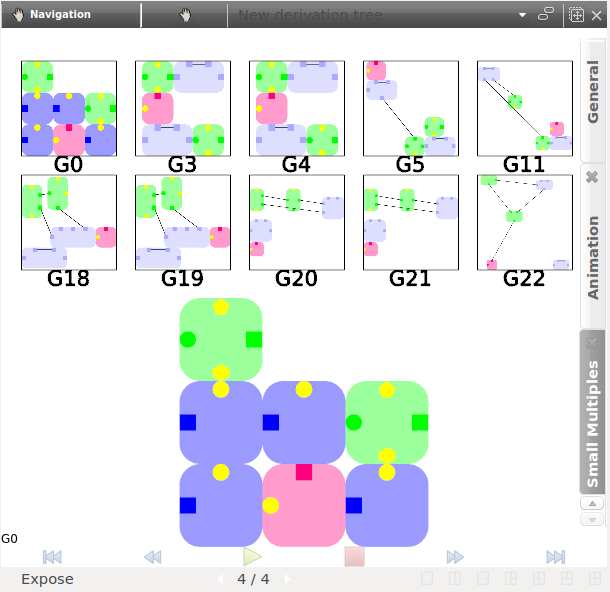

.. _views:

*************************
Presentation of the views
*************************

You will find here additional information on each of the views available in Porgy.

.. _rule_view:

Rule View
=========

This is the visualization/edition view for all the rules.

    The *Rule view* allows to create, customize and visualize rewriting rules

-----------------
Interaction tools
-----------------

.. |addPortNode| image:: _images/i_addPortNode.png
	:width: 18pt

You will find in it the following interactors:

* |i_navigation| **Navigation**: move, rotate and zoom the view. Zooming behavior: the point under the cursor is moved closer to the center.
* |i_select| **Get information**: click an element (portnode or edge) and Porgy displays all available properties of that element in the properties widget.
* |i_selection| **Rectangle selection**: select all elements touching the selection box (the previous selection is replaced, but can be recovered with Undo). With Shift, the newly selected elements are added to the current selection; with Ctrl (Alt on Mac), the selected elements are removed from the current selection.
* |i_move| **Selection edition**: modify the shape and position. Shift-click modifies only coordinates. Ctrl-click modifies only size. Left-click outside the selection resets the selection.
* |i_bends| **Edit edge bends**: click on an edge to select it (with this tool), then Shift-click to add a new bend, click a bend to move it, or Ctrl-click (Alt on Mac) to remove a bend.
* |addPortNode| **Add portnodes**: allow the user to create,edit and add portnodes. Edges can also be added between ports only by clicking the source node first then the target node. Optionally bends may be added by clicking outside of a node.
* |i_del| **Delete element**: click a portnode or edge to delete it.

-------------
Configuration
-------------

The following options can be customized using the tab on the right-side of the view:

* **Scene**: identical to the options available in **Tulip**; allows to customize the view.
* **Rule Attribute**: contains all the specific options of the current rule
   * *Layout algorithm*: select the layout algorithm to perform on the rewritten graph after applying this very rule.

---------------
Contextual menu
---------------

Perform a right-click (**Ctrl**-click Mac) to display this menu:

* **Center view**: move the camera the view all the elements.
* **Redraw**: redraw the rule and center the view.
* **Take snapshot**: open the screenshot tool.
* **Selection**: allows you to select specific parts of the rule.

.. _model_view:

Graph View
===========

This is the visualization/edition view for graphs.

    The *Graph view* is used to display the different graphs and states of the derivation tree. The view also allows first the creation then the edition of the states elements.

-----------------
Interaction tools
-----------------

You will find in it the following interactors:

* |i_navigation| **Navigation**: move, rotate and zoom the view. Zooming behavior: the point under the cursor is moved closer to the center.
* |i_select| **Get information**: click an element (portnode or edge) and Porgy displays all available properties of that element.
* |i_selection| **Rectangle selection**: select all elements touching the selection box (the previous selection is replaced, but can be recovered with Undo). With Shift, the newly selected elements are added to the current selection; with Ctrl (Alt on Mac), the selected elements are removed from the current selection.
* |i_move| **Selection edition**: modify the shape and position. Shift-click modifies only coordinates. Ctrl-click modifies only size. Left-click outside the selection resets the selection.
* |i_bends| **Edit edge bends**: click on an edge to select it (with this tool), then Shift-click to add a new bend, click a bend to move it, or Ctrl-click (Alt on Mac) to remove a bend.
* |addPortNode| **Add portnodes and edges**: allow the user to create,edit and add portnodes. Edge can also be added by clicking the source node then the target node. You can only add edge between two ports.
* |i_del| **Delete element**: click a portnode or edge to delete it.

-------------
Configuration
-------------

The following options can be customized using the tab on the right-side of the view:

* **Scene**: identical to the options available in **Tulip**; allows to customize the view.

---------------
Contextual menu
---------------

Perform a right-click (**Ctrl**-click Mac) to display this menu:

* **Center view**: move the camera to visualize all the ports in the graph.
* **Redraw**: redraw the graph and center the view. You can choose between a force drawing algorithm (GEM (Frick)) or a hierarchical drawing algorithm (Sugiyama (OGDF))
* **Take snapshot**: open the screenshot tool.
* **Save selection**: allow the user to save the current selection in a new local property or in an existing one. Click on **New property** and input the name of the new property to create a new property. To erase an existing one just click on the name of the property to replace. This is useful to create P and Ban properties.
* **Restore selection**: allow the user to replace the current selection by the selected property.

.. _trace_view:

Derivation Tree view
=====================

This is the base view for derivation trees. Displays the graphs present in a derivation tree as a hierarchy. Each edge between two graphs represents the transformation of the source to the destination.
A transformation can be an application of a rule (simple rule), an application of a strategy or a modification of the *P* property (Set position).

    The *Derivation tree* view keeps a complete trace of all user operations and can be used to explore the evolution of the graphs after rewriting.

-----------------
Interaction tools
-----------------

You will find in it the following interactors:

* |i_navigation| **Navigation**: move, rotate and zoom the view. Zooming behavior: the point under the cursor is moved closer to the center.
* |i_select| **Get information**: click an element (portnode or edge) and Porgy displays all available properties of that element.
    If you hoover an edge it will display the transformation information as a tool tip and it will highlight portnodes involved in this transformation.
    Here is the color code used when highlighting portnodes involved in a transformation:
    * Simple rule: LHS portnodes are in red and RHS are in blue.
    * Set position: portnodes that are only in the original *P* property are in red, portnodes only in the new *P* property are in blue and portnodes in both old and new are in green.
* |i_selection| **Rectangle selection**: select all elements touching the selection box (the previous selection is replaced, but can be recovered with Undo). With Shift, the newly selected elements are added to the current selection; with Ctrl (Alt on Mac), the selected elements are removed from the current selection.
* |i_zoom| **Zoom box**: draw a rectangle and zooms on this area.
* |i_metanodenavigation| **Open in a new graph view**: click on a graph and it will be displayed a new view.
* |i_move| **Selection edition**: modify the shape and position. Shift-click modifies only coordinates. Ctrl-click modifies only size. Left-click outside the selection resets the selection.
* |i_bends| **Edit edge bends**: click on an edge to select it (with this tool), then Shift-click to add a new bend, click a bend to move it, or Ctrl-click (Alt on Mac) to remove a bend.

-------------
Configuration
-------------

The following options can be customized using the tab on the right-side of the view:

* **Parameters**:

  * *Labels*: choose whether you wish to display the nodes or meta-nodes labels.
  * *Rendering parameters*: allows you to enable the edge size interpolation or to scale each label size according to their node size.

---------------
Contextual menu
---------------

Right-click (**Ctrl**-click Mac) to display this menu:

* **Center view**: move the camera the visualize all the elements in the derivation tree.
* **Redraw**: redraw the derivation tree and center the view.
* **Take snapshot**: open the screenshot tool.
* **Show Overview**: toggle top left overview

If a graph is present under the cursor some other options are available:

* **Open in a new graph view**: show the graph under the pointer in a new view.
* **Add to/Remove from the selection**: if the graph is present in the current selection remove it else add it.

Additional trace views
=======================

--------------------
Scatter plot 2D View
--------------------

This view allows to create 2d scatter plots of graph nodes from graph properties (supported types are Metric and Integer).
A scatter plot is a type of mathematical diagram using Cartesian coordinates to display values for two variables for a set of data.
The data is displayed as a collection of points, each having the value of one variable determining the position
on the horizontal axis and the value of the other variable determining the position on the vertical axis.

By selecting a set of graph properties, a scatter plot matrix will be displayed for each combination
of two different properties. Each scatter plot can then be displayed individually in a more detailed way.

A set of interaction tools are bundled with the view to perform selection, statistical analysis, ...

--------------
Histogram view
--------------

This view plug-in allows to create frequency histograms from graph properties (supported types are Metric and Integer).
By selecting a set of graph properties, frequency histograms are computed and displayed for values associated
to nodes (or edges).

This view also allows to map visual properties (colors, sizes, glyphs, ..) of the graph elements
with respect to a graph metric in a visual way. These operations can be done with the "Metric mapping"
interactor. Many interaction tools are also bundled with the view to perform elements selection, statistical analysis, ...

-------------------
Small multiple View
-------------------

This view allows to visualize the transformations between different graphs using small multiples and/or animation.
User can add intermediate states to emphasize elements present in the *P* property, the LHS and the RHS.

Small multiples are useful to have an overview of the whole states of the derivation tree.
The aim of the animation is to interpolate the change each states to show a video of the change. You see the *film* of the transformations.

    The small multiple and animation view which enable to see the evolution of a branch of a derivation tree.

Configuration
-------------

* **General**:

  * *Intermediate states*: add the corresponding intermediate states between two states.
  * *Widgets*: customize the view by selecting the widgets to display (Small multiples or Animation).
  * *Node labels*: show or hide the node label and scale the label size in function of the node size

* **Animation**:

  * *Animation duration*: animation duration between two states.
  * *Rule preview*: display or hide a preview of the rule involved in the current transformation if the current transformation involve a rule.

* **Small multiples**:

  * *Rendering parameters*: offers to force the labels of the small multiples to take the whole available space or to have an uniform font size. The margin between each preview can also be customised.
  * *Small multiples layout*: set the display options for the small-multiple view. Go for the default layout or force a specific number of lines.

